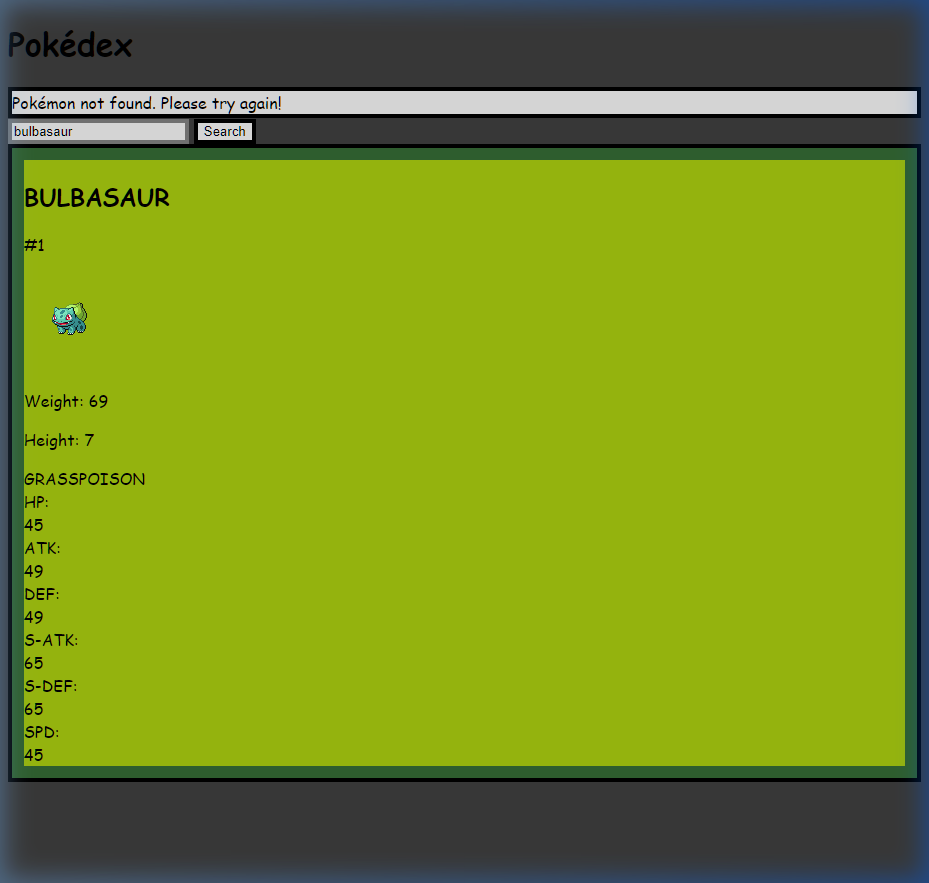

# Pokédex Search

A sleek, retro-style Pokédex application built with HTML, CSS (Tailwind), and JavaScript. It uses the [PokeAPI](https://pokeapi.co/) to fetch and display Pokémon data, including stats, types, and sprites.

## Features

- **Real-time Search**: Find Pokémon by name or ID.
- **Dynamic Stats**: View detailed stats with animated progress bars.
- **Responsive Design**: Works on mobile and desktop devices.
- **Retro Aesthetic**: Custom pixel-art borders and "Press Start 2P" typography for a classic handheld feel.

## Screenshots

<div align="center">
  
  <br>
  <em>Search results for Pikachu</em>
</div>

<div align="center">
  
  <br>
  <em>Search results for Bulbasaur</em>
</div>

## Technical Implementation

- **CSS & Design**: Utilizes Tailwind CSS for layout and custom Vanilla CSS for the pixel-border effect and animations.
- **API Integration**: Fetches data from PokeAPI using `fetch` with robust error handling for "Pokémon not found" scenarios.
- **Stat Bars**: Dynamically calculated progress bars that animate when data is loaded.

## How to Run

Simply open `index.html` in your browser, or serve it using a local server:

```bash
python -m http.server 8000
```
Then navigate to `http://localhost:8000`.
